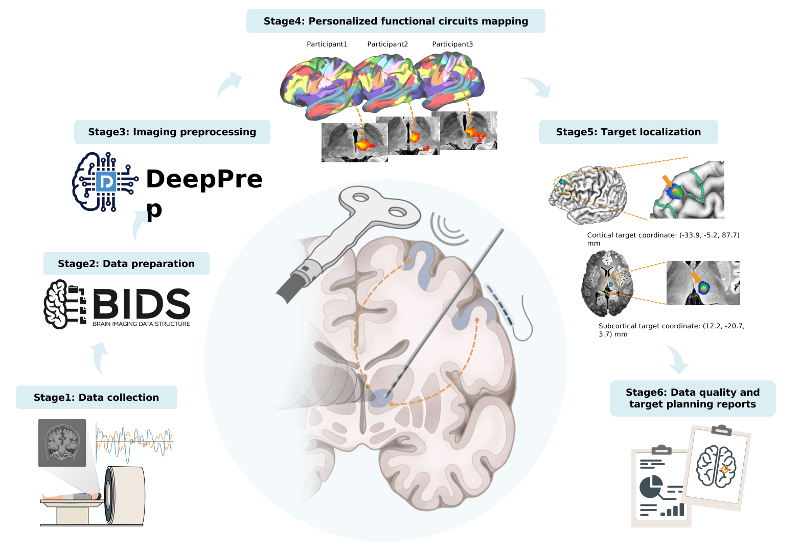
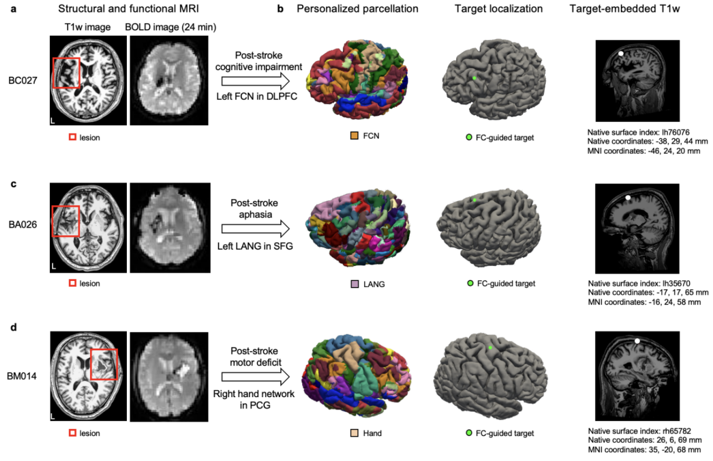

Welcome to UNITE documentation!
====================================

.. note::

    UNITE has just released the newest version **pbfslab/unite:25.1.1**.

Installation
------------

For instructions on installing and using UNITE, please refer to the documentation below.

Setting up the computing environment to initiate UNITE
~~~~~~~~~~~~~~~~~~~~~~~~~~~~~~~~~~~~~~~~~~~~~~~~~~~~~~

This section provides a step-by-step guide to configuring the environment required to run the UNITE platform using Docker. Both GUI and command-line modes are supported. This setup assumes a **Linux** host operating system. **GPU acceleration is optional but recommended** for improved processing efficiency.

1. Install Docker on Linux
~~~~~~~~~~~~~~~~~~~~~~~~~~~

A one-step installation script (`get-docker.sh`) is provided in the repository:

`https://github.com/pBFSLab/UNITE/get-docker.sh <https://github.com/pBFSLab/UNITE/get-docker.sh>`_

Download the script and execute the following command in your terminal:

.. code-block:: bash

   sudo sh get-docker.sh

2. (Optional) Install NVIDIA container toolkit for GPU support
~~~~~~~~~~~~~~~~~~~~~~~~~~~~~~~~~~~~~~~~~~~~~~~~~~~~~~~~~~~~~~~

This step is only required if you plan to use a **GPU**.

**Step 2.1**: Check if it is already installed:

.. code-block:: bash

   dpkg -l | grep nvidia-container-toolkit

If a result is returned, the toolkit is already installed. Skip to step 3.

**Step 2.2**: If not installed, run the following commands:

.. code-block:: bash

   distribution=$(. /etc/os-release;echo $ID$VERSION_ID)
   curl -s -L https://nvidia.github.io/nvidia-docker/gpgkey | sudo apt-key add -
   curl -s -L https://nvidia.github.io/nvidia-docker/$distribution/nvidia-docker.list | \
   sudo tee /etc/apt/sources.list.d/nvidia-docker.list
   sudo apt-get update && sudo apt-get install -y nvidia-container-toolkit
   sudo systemctl restart docker
After this, your system is ready to run Docker containers with GPU support.

3. Pull UNITE docker image
~~~~~~~~~~~~~~~~~~~~~~~~~~
Run the following command:

.. code-block:: bash

   sudo docker pull pbfslab/unite:25.1.1
4. Run UNITE
~~~~~~~~~~~~
Replace ``<your_local_directory>`` with your working directory path.
**Using GPU:**

.. code-block:: bash

    export unite_workdir=<your_local_directory>
    sudo docker run -it --rm --gpus all -v ${unite_workdir}:${unite_workdir} -p 8501:8501 pbfslab/unite:25.1.1

**Using CPU only:**

.. code-block:: bash

    export unite_workdir=<your_local_directory>
    sudo docker run -it --rm -v ${unite_workdir}:${unite_workdir} -p 8501:8501 pbfslab/unite:25.1.1

5. Launch UNITE GUI or use command-line mode
~~~~~~~~~~~~~~~~~~~~~~~~~~~~~~~~~~~~~~~~~~~~
- **GUI**: Open your browser and go to: `http://localhost:8501 <http://localhost:8501>`_
- **Command-line**: Refer to below command.

.. code-block:: bash

    docker run -it --rm --gpus all \
                 -v <bids_dir>:/input \
                 -v <output_dir>:/output \
                 -v <fs_license_file>:/fs_license.txt \
                 pbfslab/deepprep:target.25.1.1 \
                 /input \
                 /output \
                 participant \
                 --fs_license_file /fs_license.txt \
                 --target \ ‘Post-stroke cognition

About
-----
Neuromodulation techniques—such as transcranial magnetic stimulation (TMS), focused ultrasound stimulation (FUS), deep brain stimulation (DBS), and intracranial electrical stimulation (iES)—target specific brain functional circuits to treat various brain disorders. Resting-state fMRI (rsfMRI) has been increasingly used to map functional circuits in individual patients for target localization. However, this strategy faces three major barriers to clinical translation: time-intensive rsfMRI processing, insufficient robustness in clinical cases, and a lack of automated targeting solutions. Here, we introduce a generic, rapid, robust, and automated platform for personalized functional circuit-guided target planning across different neuromodulation techniques, termed UNITE. The platform’s high computational efficiency and robustness are empowered by DeepPrep, a recently developed end-to-end preprocessing pipeline that achieves a 10-fold speedup and improved robustness in clinical cases compared to the state-of-the-art pipeline. Using DeepPrep’s preprocessed data, the platform maps personalized functional circuits and localizes personalized targets through automated targeting algorithms. Currently, the platform offers three built-in TMS targeting algorithms for post-stroke functional rehabilitation and one FUS targeting algorithm for Parkinson’s disease (PD). Notably, it is designed to be extendable to other brain disorders and neuromodulation applications. To ensure quality and usability, the platform generates a data quality control report and a visual verification report of the identified targets, with target coordinates exported in multiple formats for compatibility with different neuronavigation systems. Overall, this platform enables personalized neuromodulation target localization within 30 minutes on a local GPU-equipped workstation. A basic level of computer science proficiency, along with neuroimaging experience, is sufficient for its use.
The following are main stages of the UNITE pipeline:

|

The UNITE comprises six stages: data collection, data preparation, data processing, personalized functional circuits mapping, automated target planning and the generation of target, and quality control reports.
 | a) To ensure the reliability of personalized functional mapping for each participant, we collect at least one high-resolution T1w MRI and a minimum of 20 minutes of resting-state fMRI data. The field map is optional but recommended for correcting susceptibility-induced distortions. After data acquisition, all imaging data are converted into the Brain Imaging Data Structure (BIDS) format, using software packages, such as BIDScoin. The BIDS format can be verified through tools, such as the BIDS Validator (https://github.com/bids-standard/bids-validator) or custom scripts. Given that head motion is a major confound of fMRI data, particularly in patient populations, we recommend performing the quick head motion pre-screening module, QuickQC, prior to running the full protocol, to determine data usability.
 | b) To achieve efficient and robust preprocessing of neuroimaging data, we employ our recently developed pipeline, DeepPrep. This advanced preprocessing framework integrates several deep learning–based modules—including FastSurfer, FastCSR, SUGAR, and SynthMorph—to enhance both computational efficiency and robustness, particularly in clinical settings. The comprehensive workflow, consisting of 83 steps, is parallelized and orchestrated using the workflow management system Nextflow (https://www.nextflow.io), enabling streamlined execution. DeepPrep allows for fully automated preprocessing within 15 to 30 minutes, representing up to a 10-fold speed improvement over conventional pipelines such as fMRIPrep. The pipeline supports both CPU and GPU execution, with GPU acceleration recommended for optimal performance. To ensure flexibility and adaptability across diverse research environments, users can customize key processing parameters, including spatial smoothing kernel size, bandpass filtering settings, and the selection of confounds to regress out (e.g., head motion parameters, cerebrospinal fluid signal, white matter signal, and global signal).
 | c) To achieve reliable personalized functional parcellation, we employed an iterative precision functional mapping (PFM) approach, as described in our previous work. To meet the requirements of different clinical applications, we provide three options of cortical functional atlases by default: the Yeo’s 18-network atlas, Gordon’s 18-network atlas and a fine-grained 213-region atlas. The Yeo 18-network atlas is derived from the original 17-network atlas47 by further subdividing the lateral sensorimotor network into distinct hand and mouth networks6. The Gordon’s 18-netwok atlas comprises 17 canonical functional networks48 and a newly identified but important network, somato-cognitive action network (SCAN). The 213-region atlas is an in-house functional parcellation generated using a coarse-to-fine strategy. These personalized functional parcellation approaches have been widely used in personalized functional-guided rTMS studies and brain-symptom association studies. The personalized functional networks or regions define the initial search space for subsequent target localization.
 | d) UNITE supports fully automated planning of both cortical and subcortical targets, adaptable to different clinical requirements and neuromodulation techniques, such as TMS, FUS, and DBS. We currently provide four built-in target planning algorithms, including three cortical TMS targets for post-stroke rehabilitation, targeting personalized cognitive-, language-, and motor impairment-related networks, and one subcortical FUS target for tremor relief in PD (see Supplementary Information for detailed descriptions). These built-in algorithms automatically localize optimal target for each individual, incorporating personalized functional parcellation, RSFC, and anatomical constrictions such as targeting gyral crowns for TMS and targeting within the thalamus for FUS. In addition, the platform is extendable to user-defined target planning algorithms, allowing flexibility for other functional network targets and diseases.
 | e) The automatically generated QC report summarizes key neuroimaging quality metrics, such as head motion, cortical surface reconstruction and parcellation, registration accuracy, and signal-to-noise ratio across all preprocessing stages. The target planning report includes the personalized functional parcellation map used for target localization, a brain map indicating the target location, and detailed target coordinates in both native anatomical and MNI standard spaces. In addition to target coordinates, a T1-weighted image with the target embedded as a 6-mm spherical region of interest (ROI) is also provided to ensure compatibility with various neuronavigation systems.

Outperforming in application to three representative patients:

|

Applications of the UNITE:

 | a) UNITE is broadly applicable to patients with neurological or psychiatric conditions, such as stroke, PD, Alzheimer’s disease (AD), major depressive disorder (MDD), and obsessive-compulsive disorder (OCD). Although these clinical populations display heterogeneous and patient-specific brain network dysfunction, their neuromodulation treatments often rely on rule-of-thumb or anatomy-based targeting. By integrating personalized functional parcellation and resting-state functional connectivity (RSFC) data, the platform can localize personalized functional circuit-guided targets, aligning with each patient’s unique pathological or symptom-specific functional networks. For example, in post-stroke aphasia patients, personalized language networks can be selectively targeted by rTMS; in PD patients, thalamic targets are optimized based on RSFC to the disease-relevant network.
 | b) UNITE is well-suited for large-scale, multi-center clinical trials and translational neuroimaging research, due to its standardized and automatic neuroimaging processing and target planning. Its standardized input-output structure, software environment and version control, and robust quality control framework enable consistent and reproducible analyses across different research sites.
 | c) UNITE allows for precise localization of functionally identified cortical and subcortical targets, enabling causal functional mapping of cognitive domains, such as language, memory, attention, or motor control through appropriate neuromodulation. This platform supports investigations into neuromodulation-induced functional reorganization, inter-individual variability in neural responses to neuromodulation, and short-term or long-term neural plasticity.

Limitations
---------------------
 | This platform is currently limited to human applications and has not yet been extended to animal studies. Future developments may include expanding the protocol to animal experiments, enabling broader and deeper scientific explorations of the mechanisms of neuromodulation. Moreover, this platform exclusively supports T1-weighted MRI data and rsfMRI data, with no compatibility for other imaging modalities, such as task-evoked fMRI and diffusion imaging. Future updates will aim to support multimodal data, for more precision and flexible target localization.

Citation
--------

License
--------

   Copyright (c) 2023-2025 pBFS lab, Changping Laboratory All rights reserved.

   Licensed under the Apache License, Version 2.0 (the "License");
   you may not use this file except in compliance with the License.
   You may obtain a copy of the License at

       http://www.apache.org/licenses/LICENSE-2.0

   Unless required by applicable law or agreed to in writing, software
   distributed under the License is distributed on an "AS IS" BASIS,
   WITHOUT WARRANTIES OR CONDITIONS OF ANY KIND, either express or implied.
   See the License for the specific language governing permissions and
   limitations under the License.
