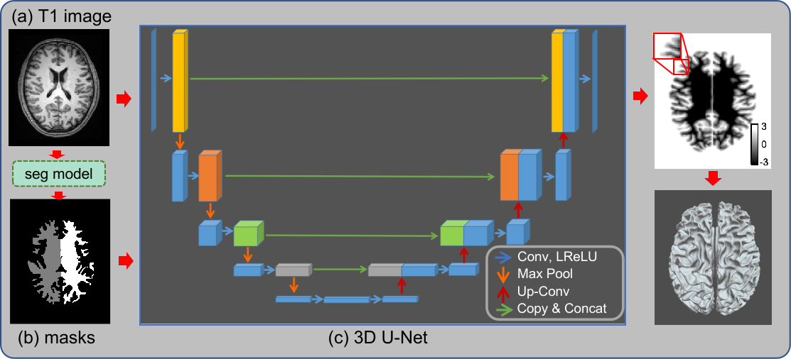

## Introduction
Reconstructing cortical surfaces from structural magnetic resonance imaging (MRI) is a prerequisite for surface-based functional and anatomical image analyses. Conventional algorithms for cortical surface construction are computationally inefficient and typically take several hours for each subject, causing a bottleneck in applications when fast turnaround time is needed. To address this challenge, here we proposed a fast cortical surface reconstruction (FastCSR) pipeline based on deep machine learning. 
The overall framework of the method is shown in the following figure.

The FastCSR workflow can be summarized into four steps. 

(a) Original T1w images are normalized and input to a 3D U-Net for segmentation. 

(b) After segmentation, hemispheric white-matter masks are generated, distinguishing the two hemispheres in the T1w images. 

(c) The hemispheric masks and the original T1w images are fed to another 3D U-Net to predict the level set representation of the cortical surface. Level set is an implicit representation of the cortical surface. 

(e) An explicit surface mesh is reconstructed from the level set representation through a fast topology-preserving isosurface extraction algorithm.

## Table of Contents
- [Environment Configuration](#environment-configuration)
  - [build the native environment](#build-the-native-environment)
  - [build inference environment using Docker](#build-inference-environment-using-docker)
  - [pre-trained model](#pre-trained-model)
  - [example data](#example-data)
- [Usage](#usage)
  - [Run example](#run-example)
- [References](#references)
- [License](#license)

## Environment Configuration 
There are two ways to run FastCSR:
- Build the native environment and run a full version, including preprocessing, surface reconstruction and optimization.
- Run a docker-based version, only including the surface reconstruction, to easily test the method.

### build the native environment
This configuration process has tested on the Ubuntu 20.04.
- Install FreeSurfer 6.0 by following the [Installation guide](https://surfer.nmr.mgh.harvard.edu/fswiki/rel6downloads)
- Java runtime environment for nighres
  - `apt install openjdk-11-jdk -y`
  - `export LD_LIBRARY_PATH=/usr/lib/jvm/java-11-openjdk-amd64/lib:/usr/lib/jvm/java-11-openjdk-amd64/lib/server` (This bash code should be executed before invoking python code which contains "import nighres". Configuring it in ~/.bashrc file or Pycharm Environment variables is a good idea.)
- `pip install nighres==1.2.0`
- `pip install -U numpy` (Due to nighres forcibly installing a lower version of numpy, it's necessary to specify a numpy version for compatibility with other packages)
- Install pytorch
  - for cpu version
  ```
  pip install torch==1.9.1+cpu torchvision==0.10.1+cpu torchaudio==0.9.1 -f https://download.pytorch.org/whl/torch_stable.html
  ```
  - for gpu version
  ```
  pip install install torch==1.9.1+cu111 torchvision==0.10.1+cu111 torchaudio==0.9.1 -f https://download.pytorch.org/whl/torch_stable.html
  ```
- `pip install nnunet==1.7.0 antspyx sh`


### build inference environment using Docker
- cpu version
  - build docker image 
  ```
  cd docker/
  docker build -t fastcsr:cpu -f Dockerfile_cpu ..
  ```
- gpu version
  - Install the NVIDIA Container Toolkit with the [installation guide](https://docs.nvidia.com/datacenter/cloud-native/container-toolkit/install-guide.html#docker).
  - build docker image
  ```
  cd docker/
  docker build -t fastcsr:gpu -f Dockerfile_gpu ..
  ```
### pre-trained model
The pre-trained model can be downloaded from [Google Drive](https://drive.google.com/drive/folders/16juh7HqsGSEcFB53Y2gzmSNVe1KMbUmR?usp=sharing) or [Baidu Netdisk](https://pan.baidu.com/s/1P9hLnxalRgFNur2SiPnOOw?pwd=8j75). After the download is completed, please store the model file in the `model` path. The directory structure is as follows.
```
model/
├── aseg_label_trans.json
├── brain_finalsurfs_model.pth
├── lh_model.pth
├── nnUNet_trained_models
│   └── nnUNet
│   └── 3d_fullres
│      ├── Task601_filled
│      └── Task602_AsegPresurf
└── rh_model.pth
```
### example data
Two example data can be downloaded from [Google Drive](https://drive.google.com/drive/folders/16juh7HqsGSEcFB53Y2gzmSNVe1KMbUmR?usp=sharing) or [Baidu Netdisk](https://pan.baidu.com/s/1P9hLnxalRgFNur2SiPnOOw?pwd=8j75). The downloaded folder structure is as follows:
```
data/
├── sub-001/
├── sub-001.nii.gz
├── sub-002/
└── sub-002.nii.gz
```
The `sub-001/` and `sub-002/` are processed by FastCSR, which can be used to verify that the code is working correctly. The `sub-001.nii.gz` and `sub-002.nii.gz` are corresponding original T1 file.
## Usage
Before running the code, you are recommended to set the **SUBJECTS_DIR** environment variable to specify the data storage directory.

The `pipeline.py` is the main user interface of FastCSR. It accepts the following parameters as run control conditions.
- `--sid` (required): Used to specify the SubjectID to be processed. When the $SUBJECTS_DIR/SubjectID folder does not exist, --t1 parameter should be specified.
- `--t1` (optional): Used to specify the T1 file to be processed.
- `--sd` (optional): Used to overwrite **SUBJECTS_DIR** environment variable.
- `--parallel_scheduling` (optional): Used to control whether parallel scheduling is enabled, the default is on.
- `--optimizing_surface` (optional): Used to control whether to perform surface optimization, the default is on.
- `--pial` (optional): Used to control whether to create pial surface, the default is False.

The file structure required for FastCSR core function execution is as follows. `$SubjectID/mri/orig.mgz` is required, which is generated by FreeSurfer command `mri_convert` from original T1 file. `aseg.presurf.mgz, brain.finalsurfs.mgz, brainmask.mgz, filled.mgz, wm.mgz` are used in some stages of FastCSR, which can be generated by FreeSurfer (**recommended**) or generated by the deep learning model integrated in this project when these files do not exist.
```
sub-001
├── label
├── mri
│   ├── aseg.presurf.mgz      (optional)
│   ├── brain.finalsurfs.mgz  (optional)
│   ├── brainmask.mgz         (optional)
│   ├── filled.mgz            (optional)
│   ├── orig.mgz              (required)
│   └── wm.mgz                (optional)
├── surf
└── tmp
```
### run example
- native environment
  ```
  python3 pipeline.py --sd ./data --sid sub-001  --t1 ./data/sub-001.nii.gz
  ```
- docker environment
  ```
  sudo docker run -it --gpus 'device=0' -v  $TestDataPath:/root/data --rm fastcsr2:gpu --sid sub-001 --sd /root/data --optimizing_surface off
  ```
  PS: Since the docker environment does not contain FreeSurfer, preprocessing and surface optimization functions cannot be performed in the docker environment.
## References
To be updated
## License
Academic research can be used freely, but commercial use requires authorization.


